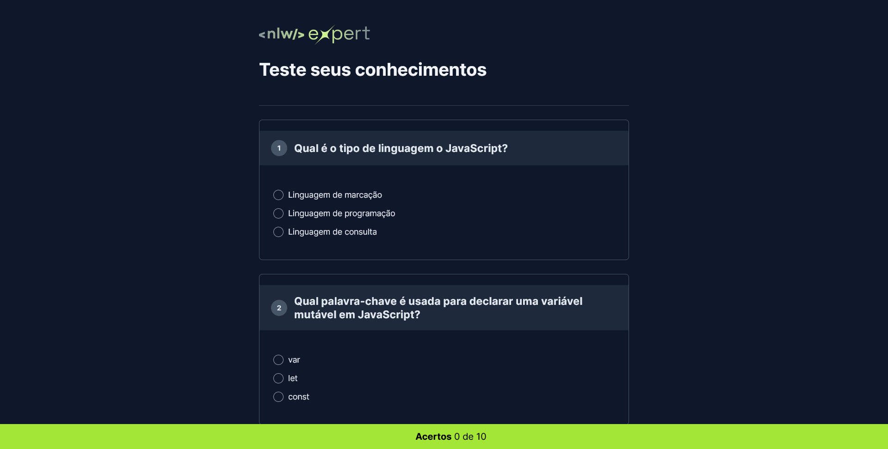

    

<h1 align="center">Quiz 📝</h1>

  <a href="#-tecnologias">Tecnologias</a>&nbsp;&nbsp;&nbsp;|&nbsp;&nbsp;&nbsp;
  <a href="#-projeto">Projeto</a>&nbsp;&nbsp;&nbsp;|&nbsp;&nbsp;&nbsp;
  <a href="#-licenca">Licença</a>&nbsp;&nbsp;&nbsp;|&nbsp;&nbsp;&nbsp;

    

## 🚀 Tecnologias
Esse projeto foi desenvolvido com as seguintes tecnologias:

- HTML
- CSS
- JavaScript

## 💻 Projeto
Esse projeto realizei juntamente com a Rocketseat através do NLW Expert, testando os meus conhecimentos técnicos e aprendedo novas caracteristicas das linguagens usadas.
 

📝 Licença
Esse projeto está sob a licença MIT.
